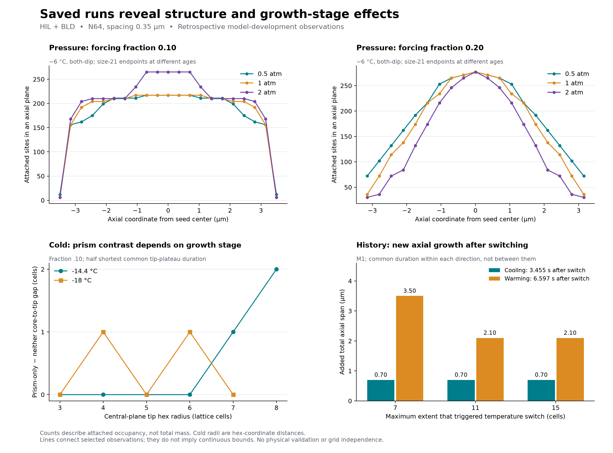

# Saved structure and incremental growth — HIL / BLD

The maker-authorized saved-data follow-up is an internal, retrospective analysis of 44 selected
rows from the completed 114-case portfolio. No new simulation, numerical law, protocol freeze,
checkpoint adoption or physical-validation claim is involved. The result makes the next questions
more specific: pressure changes off-equator occupancy as well as a narrow central opening;
history can preserve old dimensions or change new growth; and cold core/tip contrasts depend on
the observation stage. All measurements remain finite discrete-model observations at N64 and
dx 0.35 um. The narrow features still need spatial qualification.

The figure uses the JSON artifacts below without fitting or interpolation of scientific states.
Connecting lines are visual guides. Pressure panels compare size endpoints at different ages;
cold samples compare matched tip radii and physical plateau age; history bars use equal elapsed
time within each direction, not between cooling and warming. Counts are attached occupancy,
not total accreted mass. Hex radius is an integer lattice-coordinate distance.

## What the additional analysis changes

### Pressure: locate the missing occupancy

For the both-dip arm at -6 C and forcing fraction .20, the 2-atm endpoint's 2787 occupied sites
are a subset of the 1-atm endpoint's 3317 sites, itself a subset of the 0.5-atm endpoint's 3607.
All three share i/j/axial spans 21/21/19 and 277 occupied sites in the center plane.
The low-minus-high difference is exactly 820 sites: 792 in hex shells 4-9 and only 28 in shells
0-1. The profile therefore changes mainly away from the center axis and away from the seed plane.
It is not explained solely by an expanding central hole.

Narrow seven-site empty-center components also extend deeper: 12/14/16 signed axial planes
are laterally enclosed and have a straight axial opening, in increasing pressure order.
These are layers, not separate cavities. At fraction .10, total occupancy instead rises
3759/3883/4229 while center openings deepen and lateral extent changes. Occupancy alone is
therefore not a compactness or hollowness measure in these cases.

Sources: [pressure.json](pressure.json), `groups[].rows[].endpoint.profile` and
`groups[1].pairwise[2].endpoint`; [definitions, full plane table and limitations](pressure-notes.md).
Common-age profiles and extent-17-to-terminal additions are retained separately. No fixed-geometry
transport mechanism, continuous-time set inclusion or general pressure law is established.

### Temperature history: separate inherited dimensions from later additions

For switch extents 7/11/15, the M1 -6 to -14.4 C cases start with 3/7/13 axial layers and each
adds two layers over the common 3.4546535953 s post-event window. Their difference in total
axial span is entirely inherited over this selected interval. Lateral growth and attachment
counts do differ, so this statement does not describe the whole shape or all subsequent growth.

The reverse M1 history, -14.4 to -6 C, adds 10/6/6 axial layers over 6.5968936062 s, equivalent
to 3.5/2.1/2.1 um of total axial span. Its later half alone adds 4/2/2 layers. The early-switch
case therefore continues to accumulate more axial extension over that later window. These
dimension counts survive the saved bracketing alternatives. Differing size, geometry, partial
fill and vapor history remain coupled; this does not isolate a single carrier of memory.

All twelve comparisons with the four source-temperature static controls match their switched
counterpart's complete recorded prefix through the trigger cycle. Trigger-cycle attachments precede the event and
are part of the starting state, not post-event growth. Comparisons with those continued static
controls show subsequent dimension changes; their pair-specific windows must not be pooled
as one common-time comparison. No-dip histories also show history-dependent increments.

Sources: [history.json](history.json), `history[].rows[].windows`, with the event-order contract,
all four triplets, static comparisons and exact brackets in [history-notes.md](history-notes.md).

### Seed response: explain the sign reversal geometrically

At -8 C, wide-seed both/neither inclusive axial/lateral spans change from 11/19 versus 9/17
at the quartet age to 11/19 versus 11/18 at the later pair age. The neither arm catches up
axially while remaining narrower; this accounts for the aspect-ratio contrast changing sign.
The both arm still attaches 278-302 sites over the recorded bracket alternatives and expands
its integer hex-radius envelope. A plateau in its two Cartesian spans is not cessation of growth.
The tall seed's later sign remains sensitive to a two-layer discrete jump.

Source: [history.json](history.json), `seeds`, and the seed section in its notes. These observations
favor tracking later growth and discrete catch-up before adding finer temperature increments.

### Cold structure: the earlier exception is stage-specific

The earlier -18 C/.10 null describes the selected tip-seven comparison. At common tip four
and six, half the shortest recorded plateau duration gives gaps 0/0/1/1 in arm order
neither/basal-only/prism-only/both; at tips three/five/seven it gives 1/1/1/1.
At -14.4 C/.10, tips three through six give 1/1/1/1, followed by 1/1/2/2 at tip seven and
0/0/2/2 at tip eight. The core catches up with the tips in discrete stages. It is premature
to classify -18 C as a temperature without a prism-related effect or infer a new width law.

The spatial samples also expose an observation gap: both prism-enabled -14.4 C rows have
zero prism-class cells in all three saved post-initial snapshots, although reconstruction
finds prism-class cells before 177 of 229 updates in each row. Those sparse snapshots cannot
explain the later prism-related gap. Future observations should capture prism-bearing states.

Sources: [cold.json](cold.json), `groups[].stages`, with saved pre-update spatial samples and
their limits in [cold-notes.md](cold-notes.md). These remain one- or two-cell contrasts. Spatial
samples at the same named extent need not have the same geometry or physical age.

### Warm memory: persistence and continued enhancement are different questions

The existing early/full observation prefixes match through the switch. At -4.5 C, the next
7.9443102075 s common window contains 840 new attached sites for early-only versus 972 for
full enhancement; total axial spans increase 0.70 versus 2.10 um. At -5 C, the next
6.3473356667 s contains 720 versus 840 new sites and axial increments 0 versus 1.40 um.
These early/full counts and span increments are unchanged by the saved bracket alternatives.

The -5 C early-only case later resumes axial extension, as the prior full-history analysis
already established. Thus surviving openings and eventual advance do not imply unchanged growth
rate after switch-off. The broad arm has a different preparation and must not be treated as
the same switch-time state. Geometric-completion attachments are included; these counts do not
measure isolated kinetic uptake or partial fill.

Source: [warm.json](warm.json), `groups[].rows` and `earlyWholeRemainingWindow`; unchanged
opening definitions come from the existing cavity geometry helper. Its signed open-layer counts
are not independent cavities and its center-component measurement is not a complete 3D census.

## Recommended next comparisons, for discussion

1. **Qualify warm advancing openings against representation.** The physically matched grid,
   seed and width question remains the highest-value check on this structural lead. Include a
   meaningful post-cutoff growth window and retain early/full/broad distinctions. Extending the
   larger-grid resume path and measuring actual cost are prerequisites only if this option is selected.
2. **Test incremental history persistence.** M1 warming's early/late pair is a sharper candidate
   than final aspect ratio alone because its later-half axial additions differ. Cooling supplies
   a contrasting inherited-axial-span case. The wide-seed -8 C both/neither pair can distinguish
   recurring discrete catch-up from a persistent divergence over later growth.
3. **Use spatial readouts in selected pressure/cold follow-ups.** Pressure .20 extremes and .10
   context should track off-equator occupancy and center openings separately. Cold follow-ups
   should include several common tip stages, not promote the tip-seven null to a whole trajectory.
   The cold field cadence must capture actual prism-bearing states around core catch-up.
   A selected refinement or longer window has more decision value than simply filling a parameter grid.

No exact roster, new stopping target, source freeze or campaign is selected by this report.
All work stays on HIL unless representative measurements justify multiple days of work and a
BLD split. Existing completed targets and producer-specific checkpoint bindings stay immutable.
Phase 7 remains on maker hold and S6 remains closed.

## Reproduction and assurance

The four retained `.mjs` scripts reconstruct saved observations only. The pressure/history/cold
notes give complete commands. `warm.mjs <BLD campaign root> <absent output JSON>` accepts the
same restored BLD campaign root used by the cold script's `BLD_REVIEW_INPUT` environment
variable. Use fresh output paths under `out/`.
The raw campaigns are already retained in the parent joint bundle's HIL archives and the separate
tracked BLD collection; this follow-up changes no raw file. Reports bind their exact input hashes.
`plot.py [output PNG]` reads these JSON artifacts; rendered here with Python 3.13 and
Matplotlib 3.11.2 installed in task-local, disposable `out/plot-dependencies/`.

Known errors were stopped before publishing results: initial pressure result-field and warm
relative-import mistakes were corrected and successfully rerun. The warm bracket calculation
uses an exact event alone at an exact time; its preliminary broader sensitivity output remains
local staging. No raw input or numerical evolution was changed by these corrections.

The existing count/coordinate/extent/aspect reconstruction and plane/shell sums provide the
nearest-boundary checks. One bounded shared-context Codex/GPT-6 [review](review.json) independently
recomputed the selected pressure partitions, M1 history increments, cold tip-stage gaps and warm
-5 C growth window from raw coordinates. It also inspected the recorded cold field census and
interpretation. One control-count wording correction was accepted; no unresolved blocker remains.
Its limits include no solver execution, full-field audit or independent complete 44-row analysis.
The byte-preserved `review-calculate.py` was executed from `out/`; copy it there before rerunning,
because its repository locator is relative to that original location. It writes the review result
under `out/`, so use a fresh staging checkout if retaining an earlier result there.

Exact `npm.cmd test` at clean `b465e1f715f43fb6e98681ec9249f052fc1e3b18` exited zero:
235 test files / 3045 tests passed, 23 skipped, Vitest duration 900.16 seconds. Rule 7 and both
typechecks passed. [Verification](verification.json) binds the actual invocation, exit and raw logs.
Neither the review nor regression suite supplies physical-validation or grid-independence credit.
The [closeout record](closeout.json) retains useful analysis drafts and original check receipts
at primary `out/hil-saved-data-followup-2026-10-08/`; claim-bearing bytes are also tracked here.
